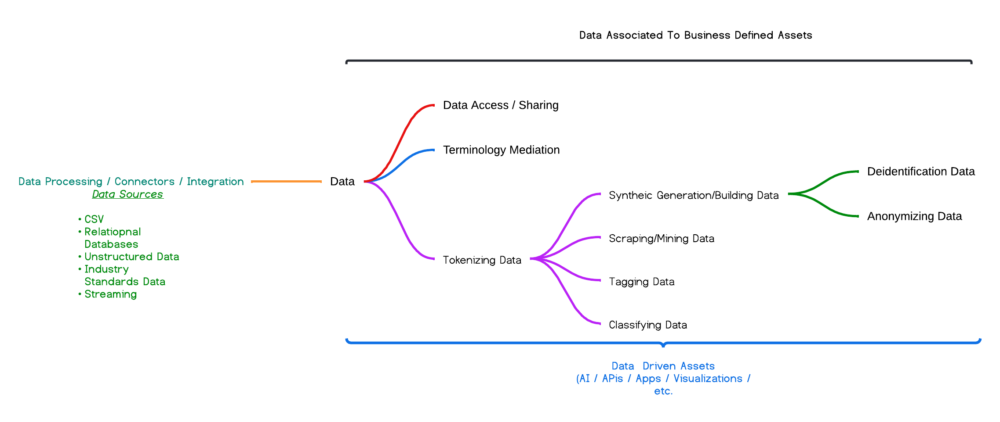

# Welcome to the Data-Connexxus GitHub site 👋
DataJediToolbelt is the evolution of a series of data enablement assets that were started in several different Git Hub organizations. The 
widest adoption (commitment to, implementation, and use) started in 2020 within [Project-Herophilus](https://github.com/Project-Herophilus/). 
With this project our focus remains <b>data as an asset</b>. Our belief is that shifting this 
and several other project to its own Git Hub repository and community will help 
us continue to focus on fulfilling business and IT needs. Our goal is to continue 
the great work has been done over the last several years by unique individuals 
and companies like Red Hat, IBM, Microsoft, and others.

Driven by our belief in <b>data as an asset</b> and all the feedback we have received, our focus will be on a community-based effort to focus on a wide 
variety of data enablement capabilities. These capabilities are intended to be used in a variety of ways to enable data-driven assets like AI, APIs, Applications, 
reports, visualizations, and more to be created/delivered or enhanced. Since data is the electricity that powers businesses and the cornerstone of companies’ 
success in the digital era, we are focused more on enabling data-driven capabilities.

Here is a visual about the platform's high-level capabilities it enables:

# Community Guiding Principles

* <b> Data is the Asset </b>
* All assets operate under the open/community source model. All repositories are provided under open source
  Apache-2 licensing model. Here is the <a href="https://opensource.org/licenses/Apache-2.0" target="_blank">Apache-2.0</a> licensing
  model.
* Our efforts are not built around some "freemium" or offering-based model with versions and scaled capabilities.
* We believe in the "powered by" model so we aim to help anyone incorporate our assets into their organizations or offerings.
* The platform is driven by the data tier and supported by technology.

# Platform
Feel free to check out our [repository layout page](https://github.com/Data-Connexxus/.github/blob/main/profile/RepositoryLayout.md), it
is intended to help navigate the numerous repositories we have in place. We continue to work
on how we deliver so many capabilities in a simplified manner. We believe that a platform 
approach that supports and sustains these efforts is critical.  To help us try and simplify 
things we break down the platform into two core areas: the data model and the 
technology that supports the data model. 

Here is a list of the data capabilities we are continuing to work to enable:

+ Data Tokenization
+ The Synthetic Data Platform
+ Data Anonymization
+ Data Tokenization
+ Data Tagging

For more details and specifics we have moved these pages into our Python code repository located
[here](https://github.com/Data-Connexxus/Code-Platform).

## Data Model
The journey in our direction has been so amazing to help and be involved in. Change in the 
data model space for the communities we lead has been a constant and an incorrect approach.
In late 2023, we removed the tight RDBMS mindset and highly complex datamodel 
to a more simplified data model. Our next step was to move from generic support 
to supporting two RDBMS technologies (PostgreSQL and SQL Server).In late 2024 we also
added SQLite support, SQLite is added to help enable the platform to centralize settings,
simplify error handling and auditing and provide a quikcly implementable way to see the platform
capabilities.

Through 2023 for all the capabilities we had there were not only in seperate repositories but also
included seperate data models. Because of this we effectively could not use multiple 
capabilities together without a lot of work that involved in most cases multiple database 
backends and different front end enabling technologies (if front end capabilities existed). 
Early in 2024 we started focusing on the overall capabilities we wanted to provide overall. 
Once we felt we had a core set of capabilities we then started work towards consolidating 
the specific capabilities individual datamodels into one. With this new focus, the base of 
the data model provides a massive amount of extensible capabilities for the future.

As we started 2025, we now have a consolidated highly functional and very performant data 
model that is relational based and computationally focused. The data model has all the 
capabilities listed above while containing billions of attributes in a very compact amount of 
storage. The data platform, depending upon the database technology is compact in size, less
than one gigabyte. 

### Core Data Model Naming Convention: Tables
While supporting a substantial amount of business use cases and needs, the data tier is elementary.
All the table names follow a specific notation <core area>_<capability>. The platform currently 
has five core areas:
- datamodel_<capability>: deals with the data model; we have all our data model documentation and details in these tables.
- datatier_<capability>: Anything the platform provides is within this area.
- platform_<capability>: All the settings, capabilities, and extensibility the platform can address are maintained within this area.
- refdata_<capability>: The platform can tag data in all ways that exist within this area.

## Technology
With such a focus on the data tier, we were very distracted and did not pay adequate respect to the technology tier for this 
platform until 2024. Since the core users and contributors to our initial platform were 
all data folks. We focused on using several technologies like SpringBoot, Node, or Quarkus, and we were not committed to 
technology providing us any substantial value aside from powering our data model. As we retooled and revamped the data tier, 
it was clear we needed to focus on a technology to provide a variety of capabilities for 
users who wanted any form of a development experience with the platform. In mid-2024, we 
settled on Python as our go-forward technology. While our work with the other technologies has been excellent, Python 
gives us the best path forward to have a complete and amazing technology stack that can 
be used for any need while also being an amazing data engineering, web, and analysis technology.

*Enjoy and Happy Coding!!!*

<!--

**Here are some ideas to get you started:**

🙋‍♀️ A short introduction - what is your organization all about?
🌈 Contribution guidelines - how can the community get involved?
👩‍💻 Useful resources - where can the community find your docs? Is there anything else the community should know?
🍿 Fun facts - what does your team eat for breakfast?
🧙 Remember, you can do mighty things with the power of [Markdown](https://docs.github.com/github/writing-on-github/getting-started-with-writing-and-formatting-on-github/basic-writing-and-formatting-syntax)
-->
