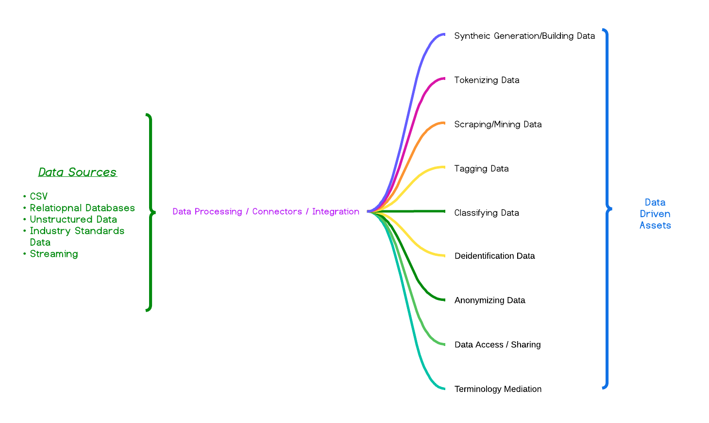

# Welcome to the Data Jedi Toolbelt GitHub site 👋
DataJediToolkit is the evolution of a series of data enablement assets that were started in several different Git Hub organizations with
the widest adoption (commitment to, implementation, and use) started in 2020 within [Project-Herophilus](https://github.com/Project-Herophilus/). 
The focus of having an open source community project is not only fulfilling its core mission but also that it needs to evolve. Clearly,
our focus on <b>data as an asset</b> resonated and is needed now more than ever. To help ensure we provide value from a community perspective and
also look at where we can continue to meet the industry's needs, shifting to a data toolkit will help us grow and continue to fulfill business and IT needs.
This new focus will help us focus better and provide a long-term viable future for a series of free-standing reusable data assets. We can focus on how to continue 
the great work has been done over the last several years by unique individuals and companies like Red Hat, IBM, Microsoft, and others.

Driven by our belief in <b>data as an asset</b> and all the feedback we have received, our focus will be on a community-based effort to focus on a wide 
variety of data enablement capabilities. These capabilities are intended to be used in a variety of ways to enable data-driven assets like AI, APIs, Applications, reports, visualizations, and more to be created/delivered or enhanced. Since data is the electricity that powers businesses and the cornerstone of companies’ success in the digital era, we are focused more on enabling data-driven capabilities.

Here is a visual about the platform's high-level capabilities it enables:

# Community Basic Understandings

* All assets operate under the open/community source model. The Synthetic Data Platform open source
  licensing model is <a href="https://opensource.org/licenses/Apache-2.0" target="_blank">Apache-2.0</a>.
  Our model is not some "freemium" or offering-based model with versions and scaled capabilities.
* We believe in the "powered by" model so we aim to help anyone incorporate our assets into their offerings.
  
# Platform
Feel free to check out our [repository layout page](https://github.com/DataJediToolbelt/.github/blob/main/profile/RepositoryLayout.md) that
is intended to provide some context to the numerous repositories we have in place. Since we are bringing so many capabilities to bear, a platform that supports and sustains these is critical.  For simplicity's sake, we break down the platform into two core areas: the data model and the 
technology that supports the data model. As we have gone to this simplified perspective, all
the components shown in the visual are capabilities surfaced by settings and data-driven configuration to address simple or complex
needs. 

<b>Note: As we are incorporating new capabilities and merging data models from other
efforts into our platform, the content is a work in progress (apart from the Synthetic Data Platform)</b>
 

  
| Capability                                                                   | 
|------------------------------------------------------------------------------|
| <a href="./SyntheticData.md" target="_blank">The Synthetic Data Platform</a> |
| <a href="./AnonymizingData.md" target="_blank">Data Anonymization</a>        |
| <a href="./DeidentifyingData.md" target="_blank">Data Deidentification</a>   |
| <a href="./TaggingData.md" target="_blank">Data Tagging</a>                  |
| <a href="./TokenizeData.md" target="_blank">Data Tokenization</a>            |

## Data Model
As we built out the data model, the initial focus was on an extensible way to support 
the Synthetic Data Platform and its needs. Because of our heavy data usage, we have 
focused on the data model for years and how to continue to drive value and address business needs with it.
Because of this focus, the base of the data model provides a massive amount of extensible capabilities that 
provide a consistent and extensible future. We are excited about enhancements to the data model and addressing specific
needs for the new capabilities.

Change us with the data model has been a constant; we started with a traditional RDBMS-based focus and mindset and evolved towards a 
more flexible and less constrained RDBMS-based data model. In late 2023, we removed the tight RDBMS mindset as it constrained our capabilities. We also 
decided to focus on a limited core set of data technologies: two RDBMS technologies (PostgreSQL and SQL Server), one EDW (SnowFlake) technology, 
and one computational platform (Spark/DataBricks). 

As we approached 2024, we have a highly functional and very performant data model that is more computational 
than relational and contains billions of attributes in a very compact amount of storage, rough 
Six hundred fifty megabytes (depending upon the specific technology used). What drives the core design of the data model now is not primary-foreign 
key data relationships, the platform's critical subsystems, and how the data tier supports their business needs while also providing enough reference data and
data associations for the data to have relevant meaning.

### Core Data Model Naming Convention: Tables
While supporting a substantial amount of business use cases and needs, the data tier is elementary.
All the table names follow a specific notation <core area>_<capability>. The platform currently 
has five core areas:
- datamodel_<capability>: deals with the data model; we have all our data model documentation and details in these tables.
- data_<capability>: this area will be implemented as we absorb other projects and efforts into this platform to ensure consistency
  and capabilities that we can deliver to continue the platform's expansive capabilities.
- datatier_<capability>: Anything the platform provides is within this area.
- platform_<capability>: All the settings, capabilities, and extensibility the platform can address are maintained within this area.
- refdata_<capability>: The platform can tag data in all ways that exist within this area.
- terms_<capability>: Any terminologies the platform might need to use depending upon the industry or general needs within this area.

## Technology
With such a focus on the data tier, we were very distracted and did not pay adequate respect to the technology tier for this 
platform until 2024. Since the core users and contributors to our initial platform were 
all data folks. We focused on using several technologies like SpringBoot, Node, or Quarkus, and we were not committed to 
technology providing us any substantial value aside from powering our data model. As we retooled and revamped the data tier, 
it was clear we needed to focus on a technology to provide a variety of capabilities for 
users who wanted any form of a development experience with the platform. In mid-2024, we 
settled on Python as our go-forward technology. While our work with the other technologies has been excellent, Python 
gives us the best path forward to have a complete and amazing technology stack that can 
be used for any need while also being an amazing data engineering, web, and analysis technology.

*Enjoy and Happy Coding!!!*

<!--

**Here are some ideas to get you started:**

🙋‍♀️ A short introduction - what is your organization all about?
🌈 Contribution guidelines - how can the community get involved?
👩‍💻 Useful resources - where can the community find your docs? Is there anything else the community should know?
🍿 Fun facts - what does your team eat for breakfast?
🧙 Remember, you can do mighty things with the power of [Markdown](https://docs.github.com/github/writing-on-github/getting-started-with-writing-and-formatting-on-github/basic-writing-and-formatting-syntax)
-->
